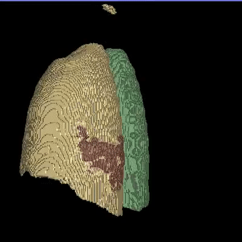

# [ROAM: Random Layer Mixup for Semi-Supervised Learning in Medical Imaging](https://arxiv.org/pdf/2003.09439.pdf)
### [Tariq Bdair](http://campar.in.tum.de/Main/TariqBdair), [Nassir Navab](http://campar.in.tum.de/Main/NassirNavab), [Shadi Albarqouni](https://albarqouni.github.io/)
Medical image segmentation is one of the major challenges addressed by machine learning methods. Yet, deep learning methods profoundly depend on a huge amount of annotated data which is time-consuming and costly. Though semi-supervised learning methods approach this problem by leveraging an abundant amount of unlabeled data along with a small amount of labeled data in the training process. Recently, MixUp regularizer has been successfully introduced to semi-supervised learning methods showing superior performance. MixUp augments the model with new data points through linear interpolation of the data at the input space. In this paper, we argue that this option is limited, instead, we propose ROAM, a RandOm lAyer Mixup, which encourages the network to be less confident for interpolated data points at randomly selected space. Hence, avoids over-fitting and enhances the generalization ability. We validate our method on publicly available datasets on whole-brain image segmentation (MALC) achieving state-of-the-art results in fully supervised (89.8%) and semi-supervised (87.2%) settings with relative improvement up to 2.75% and 16.73%, respectively.

# Whole Brain Segmentation
<!--
## Quantitative results on MALC dataset for whole brain segmentation
 <br/>
 <br/>
-->
## Qualitative results on MALC/IBSR/CANDI datasets for whole brain segmentation
 <br/>
## Comparison of brain segmentation of Unet (left) and ROAM (right) 
 </br>
# COVID-19 Segmentation
***Not validated for clinical use*** <br/> 
## Sample predictions on CT COVID-19 <br/>
**Our models (S) and (SS) are trained in supervised and semi-supervised manners respectively.**

## Comparison of COVID-19 segmentation of Unet (left) and ROAM (right)
 </br>


## Getting Started

This repository contains a PyTorch code for implementing and training ROAM. 
<br/> Also, this package provides trained models for Whole brain MRI segmentation,  and COVID-19 pathologies segmentation in Thorax CT. 
- [Whole Brain Segmentation](#Whole-Brain-Segmentation)
- [COVID-19 Segmentation](#COVID-19-Segmentation)


### Prerequisites

-Python <br/> 
-PyTorch
<br/> 
### Datasets
**Whole Brain data**
- [MALC](http://www.neuromorphometrics.com/2012_MICCAI_Challenge_Data.html) : consists of 30 T1 MRI volumes; 15 volumes split into 3 labeled (∼500 slices), 9 unlabeled (∼1500 slices), 3 validation (∼500 slices), and 15 testing volumes (∼2500 slices). The data conversion for this dataset is done as in [QuickNAT: Roy et al](https://github.com/ai-med/quickNAT_pytorch) <br/>

**COVID-19 data**
- 100 CT slices of COVID-19: used as labeled data (80/20 split for training & validation respectively), download data from [here](http://medicalsegmentation.com/covid19/)
- 200 CT slices of COVID-19 and non COVIDT-19 cases: used as unlabeled data download data from [here](https://github.com/UCSD-AI4H/COVID-CT/tree/master/Images-processed)

### Training 
- To train our model in a supervised manner for whole-brain segmentation, run the following code..
```
python train_ROAM_MALC_Supervised.py --data_path='your data path' --checkpoint_dir='path to save the trained model'
```
- To train our model in a semi-supervised manner for whole-brain segmentation, run the following code..
```
python train_ROAM_MALC_Semi.py --data_path='your data path' --checkpoint_dir='path to save the trained model'
```
- To train our model in a supervised manner for COVID-19 segmentation, run the following code..
```
python train_ROAM_Covid_Supervised.py --data_path='your data path' --checkpoint_dir='path to save the trained model'
```
- To train our model in a semi-supervised manner for  COVID-19 segmentation, run the following code..
```
python train_ROAM_Covid_Semi.py --data_path='your data path' --checkpoint_dir='path to save the trained model'
```
### Trained models
- Also, you can download already trained models as the following:-  <br/>
- [roam_malc_sup](https://campowncloud.in.tum.de/index.php/s/UlRTmD7TR1cGitj): our model trained on 15 vols. from MALC dataset in supervised manner, the data is mixed-up at the first, second, and last hidden layers.
- [roam_malc_smi_lyr2](https://campowncloud.in.tum.de/index.php/s/UlRTmD7TR1cGitj): our model trained on 3L/9U vols. from MALC dataset in semi-supervised manner, the data is mixed-up at the second hidden layer.
- [roam_malc_smi_lyrI1L](https://campowncloud.in.tum.de/index.php/s/UlRTmD7TR1cGitj): our model trained on 3L/9U vols. from MALC dataset on semi-supervised manner, the data is mixed-up at the input layer and first and last hidden layers.
- [roam_malc_smi_lyrI](https://campowncloud.in.tum.de/index.php/s/UlRTmD7TR1cGitj): our model trained on 3L/9U vols. from MALC dataset in semi-supervised manner, the data is mixed-up at the input layer (MixMatch approach).
- [roam_covid_sup](https://campowncloud.in.tum.de/index.php/s/UlRTmD7TR1cGitj): our model trained on 80 images from 60 CT scans in supervised manner for COVID-19 lung segmentation. 
- [roam_covid_semi](https://campowncloud.in.tum.de/index.php/s/UlRTmD7TR1cGitj): our model trained on 80 images from 60 CT scans in semi-supervised manner for COVID-19 lung segmentation. 

### Prediction 
- To generate the predictions (brain segmentation).
```
python generate_prediction.py --data_path='your data path' --checkpoint_dir='path to the trained model' --model_name='best_model_Img_wts.pt'
```
- To generate the predictions (COVID-19 segmentation for CT individual slices).
```
python generate_prediction_COVID.py --data_path='your data path' --checkpoint_dir='path to the trained model' --model_name='best_model_Img_wts.pt'
```
- To generate the predictions (COVID-19 segmentation for CT volume).
```
python generate_prediction_COVID_Vol.py --data_path='your data path' --checkpoint_dir='path to the trained model' --model_name='best_model_Img_wts.pt'
```
### Evaluation
- To calculte the dice score (brain segmentation).
```
python calculate_dice.py --data_path='your data path' --checkpoint_dir='path to the trained model' --model_name='best_model_Img_wts.pt'
```
- To calculte the hausdorff and mean surface distances (brain segmentation).
```
python calculateHD_MSD.py --data_path='your data path' --checkpoint_dir='path to the trained model' --model_name='best_model_Img_wts.pt'
```
- To calculte the dice score (COVID-19).
```
python calculate_dice_COVID.py --data_path='your data path' --checkpoint_dir='path to the trained model' --model_name='best_model_Img_wts.pt'
```

If you found our code useful, please cite:
```
@article{bdair2020roam,
  title={ROAM: Random Layer Mixup for Semi-Supervised Learning in Medical Imaging},
  author={Bdair, Tariq and Navab, Nassir and Albarqouni, Shadi},
  journal={arXiv preprint arXiv:2003.09439},
  year={2020}
}
```

## License

<a rel="license" href="https://creativecommons.org/licenses/by-nc/2.0/"></a>

## Acknowledgment
The authors acknowledge [MedSeg](http://medicalsegmentation.com/covid19/) for providing the labeled data for 100 CT images and making it publically available.

