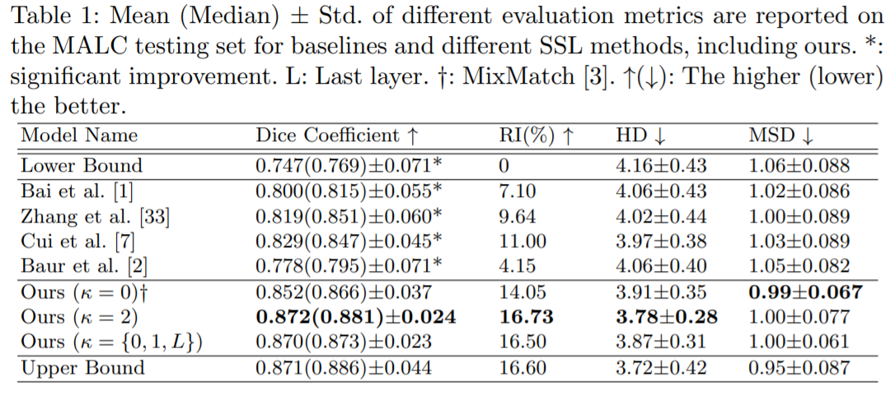
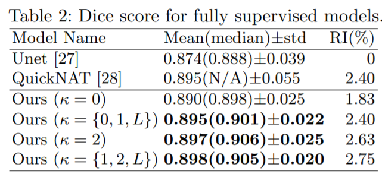
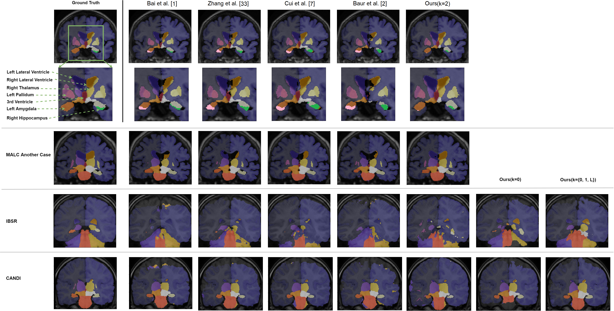
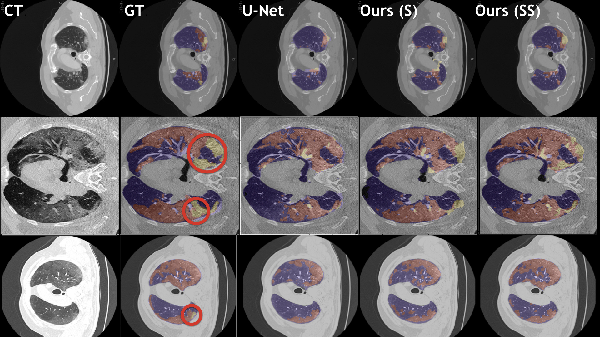

# ROAM: Random Layer Mixup for Semi-Supervised Learning in Medical Imaging
Medical image segmentation is one of the major challenges addressed by machine learning methods. Yet, deep learning methods profoundly depend on a huge amount of annotated data which is time-consuming and costly. Though semi-supervised learning methods approach this problem by leveraging an abundant amount of unlabeled data along with a small amount of labeled data in the training process. Recently, MixUp regularizer has been successfully introduced to semi-supervised learning methods showing superior performance. MixUp augments the model with new data points through linear interpolation of the data at the input space. In this paper, we argue that this option is limited, instead, we propose ROAM, a random layer mixup, which encourages the network to be less confident for interpolated data points at randomly selected space. Hence, avoids over-fitting and enhances the generalization ability. We validate our method on publicly available datasets on whole-brain image segmentation (MALC) achieving state-of-the-art results in fully supervised (89.8%) and semi-supervised (87.2%) settings with relative improvement up to 2.75% and 16.73%, respectively.
<br/> -- Link to the paper
[https://arxiv.org/pdf/2003.09439.pdf](https://arxiv.org/pdf/2003.09439.pdf) 

If you use our code, please cite:
```
@article{bdair2020roam,
  title={ROAM: Random Layer Mixup for Semi-Supervised Learning in Medical Imaging},
  author={Bdair, Tariq and Navab, Nassir and Albarqouni, Shadi},
  journal={arXiv preprint arXiv:2003.09439},
  year={2020}
}
```
## Getting Started

This repository contains a PyTorch code for implementing and training ROAM. 
<br/> Also, this package provides trained models for MRI whole brain segmentation,  and CT COVID-19 lung segmentation. 
- [Whole Brain Segmentation](#Whole-Brain-Segmentation)
- [COVID-19 Segmentation](#COVID-19-Segmentation)


### Prerequisites

-Python <br/> 
-PyTorch

### Training 
- To train our model in a supervised manner for whole-brain segmentation, run the following code..
```
python train_ROAM_MALC_Supervised.py --data_path='your data path' --checkpoint_dir='path to save the trained model'
```
- To train our model in a semi-supervised manner for whole-brain segmentation, run the following code..
```
python train_ROAM_MALC_Semi.py --data_path='your data path' --checkpoint_dir='path to save the trained model'
```
- To train our model in a supervised manner for COVID-19 segmentation, run the following code..
```
python train_ROAM_Covid_Supervised.py --data_path='your data path' --checkpoint_dir='path to save the trained model'
```
- To train our model in a semi-supervised manner for  COVID-19 segmentation, run the following code..
```
python train_ROAM_Covid_Semi.py --data_path='your data path' --checkpoint_dir='path to save the trained model'
```
### Trained models
- Also, you can download already trained models as the following:-  <br/>
- [roam_malc_sup](trainedmodels/raom_malc_sup.pt): our model trained on 15 vols. from MALC dataset on supervised manner for whole brain segmentation.
- [roam_malc_smi_lyr2](trainedmodels/roam_malc_smi_lyr2.pt): our model trained on 3L/9U vols. from MALC dataset on semi-supervised manner for whole brain segmentation, the data is mixed-up at the second hidden layer.
- [roam_malc_smi_lyrI1L](trainedmodels/roam_malc_smi_lyrI1L.pt): our model trained on 3L/9U vols. from MALC dataset on semi-supervised manner for whole brain segmentation, the data is mixed-up at the input, first and last hidden layers.
- [roam_malc_smi_lyrI](trainedmodels/roam_malc_smi_lyrI.pt): our model trained on 3L/9U vols. from MALC dataset on semi-supervised manner for whole brain segmentation, the data is mixed-up at the input layer (MixMatch approach).
- [roam_covid_sup](trainedmodels/roam_covid_sup.pt): our model trained on 80 images from 60 CT scans on supervised manner for COVID-19 lung segmentation. The used data is found [here](http://medicalsegmentation.com/covid19/) 
- [roam_covid_semi](trainedmodels/roam_covid_semi.pt): our model trained on 80 images from 60 CT scans on semi-supervised manner for COVID-19 lung segmentation. The labeled data is found [here](http://medicalsegmentation.com/covid19/), the unlabeled data is found [here](https://github.com/UCSD-AI4H/COVID-CT/tree/master/Images-processed)
### Evaluation
- To calculte the dice score (brain segmentation).
```
python calculate_dice.py --data_path='your data path' --checkpoint_dir='path to the trained model' --model_name='best_model_Img_wts.pt'
```
- To calculte the hausdorff and mean surface distances (brain segmentation).
```
python calculateHD_MSD.py --data_path='your data path' --checkpoint_dir='path to the trained model' --model_name='best_model_Img_wts.pt'
```
- To calculte the dice score (COVID-19).
```
python calculate_dice_COVID.py --data_path='your data path' --checkpoint_dir='path to the trained model' --model_name='best_model_Img_wts.pt'
```
### Prediction 
- To generate the predictions (brain segmentation).
```
python generate_prediction.py --data_path='your data path' --checkpoint_dir='path to the trained model' --model_name='best_model_Img_wts.pt'
```
- To generate the predictions (COVID-19 segmentation for CT individual slices).
```
python generate_prediction_COVID.py --data_path='your data path' --checkpoint_dir='path to the trained model' --model_name='best_model_Img_wts.pt'
```
- To generate the predictions (COVID-19 segmentation for CT volume).
```
python generate_prediction_COVID_Vol.py --data_path='your data path' --checkpoint_dir='path to the trained model' --model_name='best_model_Img_wts.pt'
```
# Whole Brain Segmentation
**Quantitative results on MALC dataset for whole brain segmentation**
 <br/>
 <br/>
**Qualitative results on MALC/IBSR/CANDI datasets for whole brain segmentation**


# COVID-19 Segmentation
**Sample predictions on CT COVID-19** <br/>
**Our models (S) and (SS) are trained in supervised and semi-supervised manners respectively. The labeled data is found [here](http://medicalsegmentation.com/covid19/), the unlabeled data is found [here](https://github.com/UCSD-AI4H/COVID-CT/tree/master/Images-processed)** <br/>

## Authors

* [**Tariq Bdair**](http://campar.in.tum.de/Main/TariqBdair)
* [**Dr. Shadi Albarqouni**](http://campar.in.tum.de/Main/TariqBdair)

See also other works from [**MedIA**](http://campar.in.tum.de/Chair/ResearchIssueMedicalImage) group.

## License

This project is licensed under the MIT License - see the [LICENSE.md](LICENSE.md) file for details

## Acknowledgments

The data ocversion for MALC dataset is done as in **QuickNAT: Abhijit Guha Roy et al**


